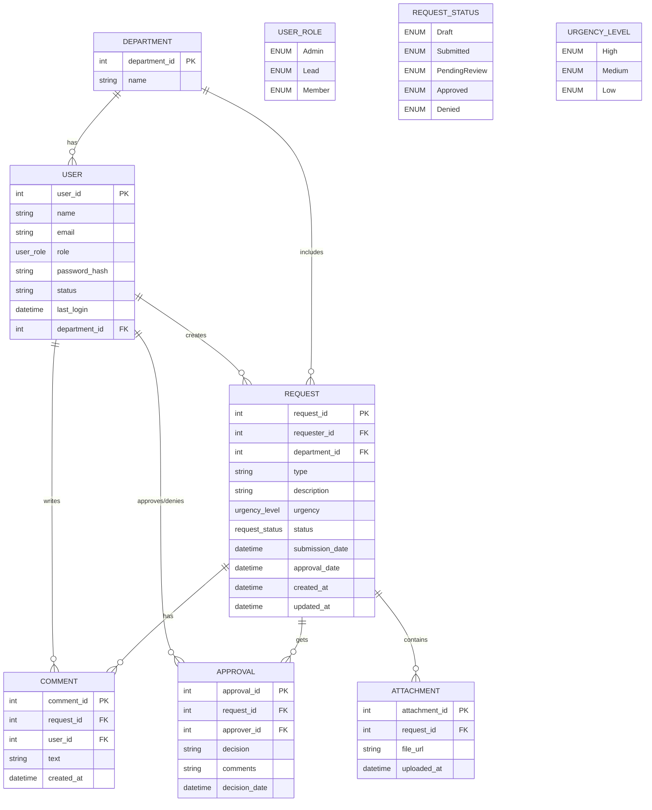

# Product Requirement Document

Project: CRMS (Church Resource Management System)
Version: 1.0

## 1. Overview

CRMS is a web application that enables users to create, track, and manage requests for equipment or resources within departments. The system provides a streamlined approval process, role-based access, and request lifecycle tracking.

## 2. Goals

- Provide a centralized system for handling equipment/resource requests.

- Ensure requests are approved/denied by the appropriate authority.

- Improve transparency with request tracking and notifications.

- Enforce access control via roles (Admin, Lead, Member).

## 3. Success Metrics

- 95% of requests submitted digitally (vs. manual).

- Request approval/denial time reduced by 30%.

- No more than 1% of failed or incomplete submissions.

- Positive user adoption measured by ≥80% active users within 3 months.

## 4. Key Features

### 4.1 User Registration

- Users are invited by Admins via email.

- Invitation link leads to account setup page.

- Invitation links expire after a set time (e.g., 7 days).

- Only Admins can invite new users.

### 4.2 Request Creation

- Authenticated users (Members/Leads/Admins) can create requests.

- Requests may be saved as drafts before submission.

- Requests may include attachments (documents, invoices, images).

### 4.3 Request Approval Workflow

- Requests move through statuses:

  - Draft → Submitted → Pending Review → Approved/Denied

- Leads approve/deny requests within their department.

- Admins can approve/deny any request.

- Approvers may leave comments with decisions.

- Rejected requests may be resubmitted.

### 4.4 Notification

- Email/notification is sent when:

  - Request is created.

  - Request status changes (approved/denied).

  - User is invited to join the system.

### 4.5 Audit Logging

- Track who created/modified/approved/denied each request.

- Maintain timestamps for all significant actions.

## 5. User Roles & Permissions

Admin

- Created from backend.

- Full system access.

- Manage users (invite, remove, deactivate).

- Approve/deny all requests.

- Manage user access rights.

Lead

- Scoped to their department.

- Create, edit, delete requests for their department.

- Approve/deny requests for their department.

- Comment on requests in their department.

Member

- Create, edit, delete their own requests.

- Save requests as draft.

- Submit requests for approval.

- Track status of their requests.

- Comment on their requests.

## 6. Data Model

### 6.1 Request

- Request ID (auto-generated)

- Requester Name

- Requester Email

- Department

- Type of Request (Equipment, Budget)

- Detailed Description

- Urgency Level (High, Medium, Low)

- Attachments

- Status (Draft, Submitted, Pending Review, Approved, Denied)

- Approver Name

- Approval Date

- Approval Comments

- Created Date

- Last Updated

### 6.2 User

- User ID (auto-generated)

- Name

- Email

- Role (Admin, Lead, Member)

- Department (Sound, Ambience, Choir, Protocol, Children, Hospitality)

- Password (hashed/salted)

- Status (Active, Inactive)

- Last Login

## 7. Technology Stack

- Frontend: Next.js

- Backend: NestJS

- Database: PostgreSQL

- ORM: Prisma

- Authentication: JWT / OAuth2 (TBD)

- Hosting: GCP

## 8. ERD

